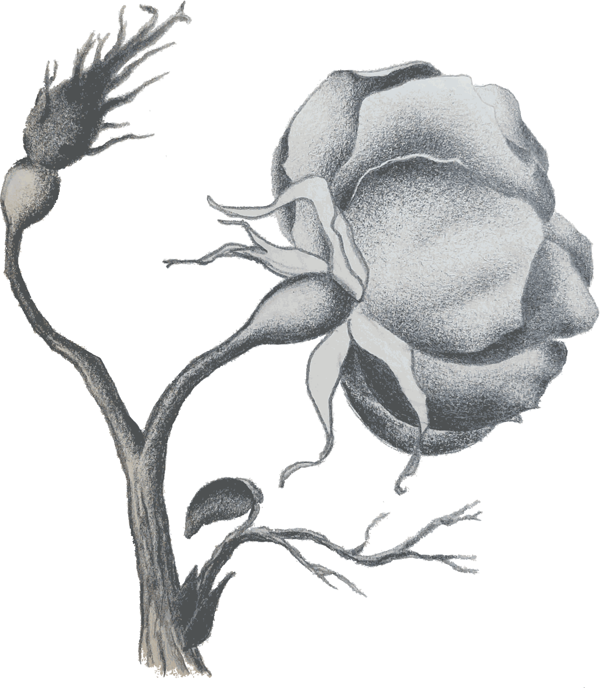

# Quiz 6, Geog 572

For Quiz 6, I applied Illustrator's Live Trace to a grayscale drawing I had done of a rose a while back. Given the gradation in values from white to black, along with heavy use of shading, I was curious how the tool would alter the original drawing. 

I did not scan the image (when I've scanned images I've drawn before that have a great deal of shading there is often a problem with reflectivity for the most heavily shaded area in the scanned image), instead taking a photo with my phone camara. There is shadowing from the binding of my sketchbook, as well as an uneven tone in the paper from one side of the image to the other due to lighting conditions. The paper itself has an offwhite hue that translates from almost white on the better-lit right hand portion of the image to brown-tans in the darker, more diffusely lit left hand region of the photo.

There are numerous small smudges and lines that did not erase well from the original sketch that I altered when I went through with the final shading, which I was interested in seeing how Illustrator handeled in the vectorized image.

In the Live Trace options I tried selecting black and white, as well as grayscale, to see the impact on the output image. I also varied the number of max colors from the default 6 up to 50. I settled on the full color option for mode (grayscale looked washed out in its shading, and black and white, while interesting, was overall more disorienting to look at than aesthetically pleasing) with a max color of 25 for the final image below.

The 25 color vectorized image captured the gradation of shading fairly well, and makes for an interesting pattern along the stem and leaves. The rosebud in the upper left looks like what I imagine an alien seed pod holding hallucegenic spores would look like, but then, the original image looked somewhat like that to begin with. The effect was simply magnified through vectorization, I suppose. Zooming in on the image, the shading effect of the vectorized shapes on the petals is somewhat smoother than I expected, and I think some of the texture of the paper (which caught the shading from the pencil in a somewhat rough fashion) shines through to some extent, not an effect I expected to see after such heavy alteration.
